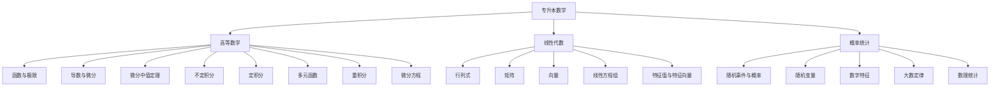

# 📚 专升本数学高效学习笔记

  <strong>专为专升本考生设计 | 系统全面 | 通俗易懂 | 实用高效</strong>

---

## 🎯 使用说明

### 📖 笔记特点
- ✅ **结构清晰**：按照专升本数学标准大纲组织
- ✅ **内容全面**：涵盖高数、线代、概率统计三门课程
- ✅ **通俗易懂**：用简单语言解释复杂概念
- ✅ **实例丰富**：每个知识点都配有详细示例
- ✅ **练习充分**：每章都配有精选练习题
- ✅ **答案完整**：所有练习题都有详细解答
- ✅ **记忆技巧**：提供高效记忆方法和口诀
- ✅ **考试技巧**：包含专升本考试常见题型和解题策略

### 🔍 学习建议
1. **系统学习**：按章节顺序学习，打好基础
2. **理解为主**：不要死记硬背，理解公式背后的含义
3. **勤做练习**：学完一章后立即做对应练习题
4. **定期复习**：每周回顾已学内容，巩固记忆
5. **模拟测试**：每月进行一次模拟考试，检验学习效果

### ⏰ 学习计划参考
- **第一阶段（1-2个月）**：完成高等数学部分
- **第二阶段（1个月）**：完成线性代数部分  
- **第三阶段（1个月）**：完成概率统计部分
- **第四阶段（1个月）**：总复习和模拟考试

---

## 📋 目录索引

### 第一部分：高等数学
- [[高等数学/高等数学_索引|查看高等数学完整目录]]
  - [[高等数学/01_函数与极限|第一章：函数与极限]]
  - [[高等数学/02_导数与微分|第二章：导数与微分]]
  - [[高等数学/03_微分中值定理与导数的应用|第三章：微分中值定理与导数的应用]]
  - [[高等数学/04_不定积分|第四章：不定积分]]
  - [[高等数学/05_定积分|第五章：定积分]]
  - [[高等数学/06_多元函数微分学|第六章：多元函数微分学]]
  - [[高等数学/07_重积分|第七章：重积分]]
  - [[高等数学/08_微分方程|第八章：微分方程]]

### 第二部分：线性代数
- [[线性代数/线性代数_索引|查看线性代数完整目录]]
  - [[线性代数/01_行列式|第一章：行列式]]
  - [[线性代数/02_矩阵|第二章：矩阵]]
  - [[线性代数/03_向量|第三章：向量]]
  - [[线性代数/04_线性方程组|第四章：线性方程组]]
  - [[线性代数/05_矩阵的特征值与特征向量|第五章：矩阵的特征值与特征向量]]

### 第三部分：概率统计
- [[概率统计/概率统计_索引|查看概率统计完整目录]]
  - [[概率统计/01_随机事件与概率|第一章：随机事件与概率]]
  - [[概率统计/02_随机变量及其分布|第二章：随机变量及其分布]]
  - [[概率统计/03_多维随机变量|第三章：多维随机变量]]
  - [[概率统计/04_随机变量的数字特征|第四章：随机变量的数字特征]]
  - [[概率统计/05_大数定律与中心极限定理|第五章：大数定律与中心极限定理]]
  - [[概率统计/06_数理统计基础|第六章：数理统计基础]]

---

## 🧠 专升本数学知识体系图

## 📊 专升本数学考试分析

### 🎯 考试特点
- **题型分布**：选择题(40%) + 填空题(20%) + 解答题(40%)
- **难度比例**：基础题(60%) + 中等题(30%) + 难题(10%)
- **高频考点**：极限计算、导数应用、积分计算、线性方程组

### ⏰ 时间分配建议
| 题型 | 题量 | 建议时间 | 策略 |
|------|------|----------|------|
| 选择题 | 8题 | 20分钟 | 快速判断，排除法 |
| 填空题 | 4题 | 15分钟 | 直接计算，注意格式 |
| 解答题 | 4题 | 55分钟 | 步骤清晰，分步得分 |

### 💯 得分技巧
1. **选择题**：特殊值法、排除法、图形法
2. **填空题**：结果精确，注意单位
3. **解答题**：步骤完整，公式写对也有分

---

## 🎓 快速查阅表

### 📝 常用数学符号
| 符号 | 含义 | 示例 |
|------|------|------|
| $\lim$ | 极限 | $\lim_{x \to 0} \frac{\sin x}{x} = 1$ |
| $\frac{dy}{dx}$ | 导数 | $\frac{d}{dx}(x^2) = 2x$ |
| $\int$ | 积分 | $\int x dx = \frac{1}{2}x^2 + C$ |
| $\sum$ | 求和 | $\sum_{i=1}^n i = \frac{n(n+1)}{2}$ |
| $\prod$ | 乘积 | $\prod_{i=1}^n i = n!$ |

### 🔢 重要常数
- $\pi \approx 3.1415926535$
- $e \approx 2.7182818284$
- $\sqrt{2} \approx 1.4142135623$
- $\sqrt{3} \approx 1.7320508075$

### 🧮 常用公式速查
1. **二次方程求根**：$x = \frac{-b \pm \sqrt{b^2-4ac}}{2a}$
2. **三角函数关系**：$\sin^2 x + \cos^2 x = 1$
3. **导数公式**：$(x^n)' = nx^{n-1}$
4. **积分公式**：$\int x^n dx = \frac{x^{n+1}}{n+1} + C$（$n \neq -1$）

---

## 🧠 记忆技巧与口诀

### 🔄 极限计算口诀
> **"先代入，再化简，洛必达，泰勒展"**
> 1. 先尝试直接代入
> 2. 不能代入就化简
> 3. 0/0或∞/∞用洛必达
> 4. 复杂极限用泰勒展开

### 📏 导数计算口诀
> **"幂指对，三角反，复合链，隐函导"**
> 1. 幂函数、指数、对数记住公式
> 2. 三角函数、反三角函数记住公式
> 3. 复合函数用链式法则
> 4. 隐函数用隐函数求导法

### 📐 积分计算口诀
> **"凑微分，换元法，分部积，有理分"**
> 1. 先看能否凑微分
> 2. 根式、三角用换元
> 3. 乘积形式用分部
> 4. 有理函数拆部分

---

  <h3>🚀 开始学习</h3>
  
建议从 [[高等数学/01_函数与极限|第一章：函数与极限]] 开始

---
tags:
  - 专升本
  - 数学笔记
  - 高等数学
  - 线性代数
  - 概率统计
  - 学习指南
  - 索引
---