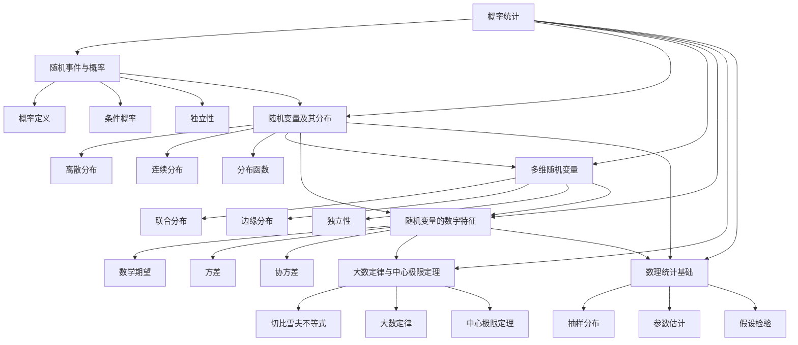

# 📊 概率统计部分索引

  <strong>专升本概率统计学习指南 | 6章完整框架 | 待补充内容</strong>

---

## 🎯 概率统计学习目标
概率统计是研究随机现象数量规律的数学分支，在数据分析、机器学习、风险评估等领域有广泛应用。通过本部分学习，你将掌握：
- 随机事件与概率的基本概念
- 随机变量的分布函数和数字特征
- 多维随机变量的联合分布
- 大数定律和中心极限定理
- 数理统计的基本方法

## 📋 章节导航

### 第一章：随机事件与概率
- **主要内容**：随机事件、概率定义、条件概率、独立性
- **学习重点**：掌握概率计算的基本方法
- **文件链接**：[[01_随机事件与概率|第一章详细内容]]

### 第二章：随机变量及其分布
- **主要内容**：随机变量概念、分布函数、常见分布、随机变量函数
- **学习重点**：理解不同分布的特点和应用场景
- **文件链接**：[[02_随机变量及其分布|第二章详细内容]]

### 第三章：多维随机变量
- **主要内容**：联合分布、边缘分布、条件分布、独立性
- **学习重点**：掌握多维随机变量的分析方法
- **文件链接**：[[03_多维随机变量|第三章详细内容]]

### 第四章：随机变量的数字特征
- **主要内容**：数学期望、方差、协方差、相关系数、矩
- **学习重点**：掌握随机变量的数值特征计算方法
- **文件链接**：[[04_随机变量的数字特征|第四章详细内容]]

### 第五章：大数定律与中心极限定理
- **主要内容**：切比雪夫不等式、大数定律、中心极限定理
- **学习重点**：理解概率论中的极限定理
- **文件链接**：[[05_大数定律与中心极限定理|第五章详细内容]]

### 第六章：数理统计基础
- **主要内容**：样本与统计量、抽样分布、参数估计、假设检验
- **学习重点**：掌握统计推断的基本方法
- **文件链接**：[[06_数理统计基础|第六章详细内容]]

---

## 🔗 知识关联图

## 📊 学习建议

### 学习顺序
1. **基础阶段**（1-2章）：随机事件 → 随机变量分布
2. **核心阶段**（3-4章）：多维随机变量 → 数字特征
3. **理论阶段**（5章）：极限定理
4. **应用阶段**（6章）：数理统计

### 时间分配
- **第一章**：1-2周（概率基础）
- **第二章**：2-3周（分布理论）
- **第三章**：2周（多维分析）
- **第四章**：2周（数字特征）
- **第五章**：1-2周（极限定理）
- **第六章**：2-3周（统计推断）

### 练习建议
1. **概念理解**：概率统计概念抽象，需要多举例理解
2. **计算练习**：多做概率计算和统计推断题目
3. **联系实际**：思考概率统计在生活中的应用
4. **软件辅助**：可以使用Python、R等软件验证计算结果

---

## 🧠 核心概念速查

### 概率基础
1. **概率定义**：$P(A) = \frac{\text{事件A发生的次数}}{\text{总试验次数}}$
2. **条件概率**：$P(A|B) = \frac{P(AB)}{P(B)}$
3. **全概率公式**：$P(A) = \sum_{i=1}^n P(B_i)P(A|B_i)$
4. **贝叶斯公式**：$P(B_i|A) = \frac{P(B_i)P(A|B_i)}{\sum_{j=1}^n P(B_j)P(A|B_j)}$

### 常见分布
1. **二项分布**：$B(n, p)$
2. **泊松分布**：$P(\lambda)$
3. **正态分布**：$N(\mu, \sigma^2)$
4. **均匀分布**：$U(a, b)$
5. **指数分布**：$Exp(\lambda)$

### 数字特征
1. **数学期望**：$E(X) = \sum x_i p_i$（离散）或 $E(X) = \int_{-\infty}^{\infty} x f(x) dx$（连续）
2. **方差**：$D(X) = E[(X - E(X))^2]$
3. **协方差**：$Cov(X,Y) = E[(X - E(X))(Y - E(Y))]$
4. **相关系数**：$\rho_{XY} = \frac{Cov(X,Y)}{\sqrt{D(X)D(Y)}}$

---

## ⚠️ 内容状态说明
**注意**：概率统计部分目前为框架文件，详细内容需要后续补充。每个章节文件包含了基本结构和学习目标，具体知识点和例题待完善。

## 🔄 返回主索引
返回 [[../专升本数学笔记_索引|主索引页面]]

---
tags:
  - 概率统计
  - 概率论
  - 数理统计
  - 随机变量
  - 分布
  - 专升本
  - 数学笔记
  - 索引
  - 框架
---