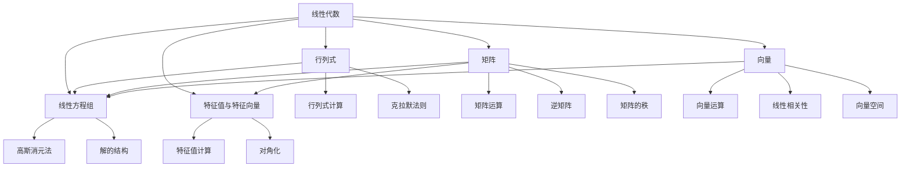

# 📈 线性代数部分索引

  <strong>专升本线性代数学习指南 | 5章完整框架 | 待补充内容</strong>

---

## 🎯 线性代数学习目标
线性代数是数学的重要分支，主要研究向量、向量空间、线性变换和线性方程组。通过本部分学习，你将掌握：
- 行列式的计算和性质
- 矩阵的运算和性质
- 向量的线性相关性和秩
- 线性方程组的解法
- 特征值与特征向量的计算

## 📋 章节导航

### 第一章：行列式
- **主要内容**：行列式概念、性质、展开定理、克拉默法则
- **学习重点**：掌握行列式计算方法和克拉默法则
- **文件链接**：[[01_行列式|第一章详细内容]]

### 第二章：矩阵
- **主要内容**：矩阵概念与运算、逆矩阵、矩阵的秩、初等变换
- **学习重点**：掌握矩阵运算和初等变换
- **文件链接**：[[02_矩阵|第二章详细内容]]

### 第三章：向量
- **主要内容**：向量概念与运算、线性相关性、向量组的秩、向量空间
- **学习重点**：理解线性相关性和向量空间概念
- **文件链接**：[[03_向量|第三章详细内容]]

### 第四章：线性方程组
- **主要内容**：线性方程组概念、高斯消元法、解的结构、齐次方程组
- **学习重点**：掌握线性方程组的解法
- **文件链接**：[[04_线性方程组|第四章详细内容]]

### 第五章：矩阵的特征值与特征向量
- **主要内容**：特征值与特征向量概念、计算、相似矩阵、对角化
- **学习重点**：掌握特征值计算和对角化方法
- **文件链接**：[[05_矩阵的特征值与特征向量|第五章详细内容]]

---

## 🔗 知识关联图

## 📊 学习建议

### 学习顺序
1. **基础阶段**（1-3章）：行列式 → 矩阵 → 向量
2. **应用阶段**（4-5章）：线性方程组 → 特征值与特征向量

### 时间分配
- **第一章**：1-2周（行列式计算）
- **第二章**：2-3周（矩阵运算）
- **第三章**：2周（向量理论）
- **第四章**：2-3周（方程组解法）
- **第五章**：2周（特征值问题）

### 练习建议
1. **每章学习**：先理解概念，再练习计算
2. **联系实际**：线性代数在计算机、物理、工程中有广泛应用
3. **综合应用**：将行列式、矩阵、向量知识综合应用于方程组求解

---

## 🧠 核心概念速查

### 行列式
1. **二阶行列式**：$\begin{vmatrix} a & b \\ c & d \end{vmatrix} = ad - bc$
2. **三阶行列式**：对角线法则或按行展开

### 矩阵运算
1. **矩阵加法**：对应元素相加
2. **矩阵乘法**：行乘列法则
3. **逆矩阵**：$AA^{-1} = A^{-1}A = I$

### 向量运算
1. **向量加法**：平行四边形法则
2. **数量积**：$\vec{a} \cdot \vec{b} = |\vec{a}||\vec{b}|\cos\theta$
3. **向量积**：$\vec{a} \times \vec{b}$（三维空间）

---

## ⚠️ 内容状态说明
**注意**：线性代数部分目前为框架文件，详细内容需要后续补充。每个章节文件包含了基本结构和学习目标，具体知识点和例题待完善。

## 🔄 返回主索引
返回 [[../专升本数学笔记_索引|主索引页面]]

---
tags:
  - 线性代数
  - 矩阵
  - 行列式
  - 向量
  - 专升本
  - 数学笔记
  - 索引
  - 框架
---