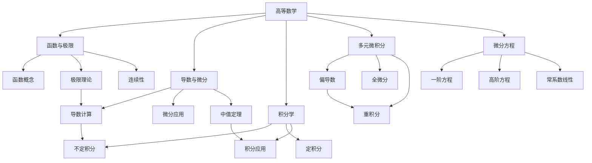

# 📚 高等数学部分索引

  <strong>专升本高等数学学习指南 | 8章完整内容 | 系统学习</strong>

---

## 🎯 高等数学学习目标
高等数学是专升本数学的核心部分，包含微积分的基础内容。通过本部分学习，你将掌握：
- 函数、极限与连续性的基本概念
- 导数与微分的计算和应用
- 积分学的基本理论和方法
- 多元函数微积分初步
- 微分方程的基本解法

## 📋 章节导航

### 第一章：函数与极限
- **主要内容**：函数概念、初等函数、数列极限、函数极限、连续性
- **学习重点**：掌握极限计算方法和连续性判断
- **文件链接**：[[01_函数与极限|第一章详细内容]]

### 第二章：导数与微分
- **主要内容**：导数概念、求导法则、高阶导数、隐函数求导、微分
- **学习重点**：熟练各种求导法则，理解微分应用
- **文件链接**：[[02_导数与微分|第二章详细内容]]

### 第三章：微分中值定理与导数的应用
- **主要内容**：三大中值定理、洛必达法则、泰勒公式、函数性态分析
- **学习重点**：掌握中值定理应用和函数性态分析
- **文件链接**：[[03_微分中值定理与导数的应用|第三章详细内容]]

### 第四章：不定积分
- **主要内容**：不定积分概念、基本积分公式、换元法、分部积分法
- **学习重点**：熟练积分计算技巧
- **文件链接**：[[04_不定积分|第四章详细内容]]

### 第五章：定积分
- **主要内容**：定积分概念、微积分基本定理、定积分计算、广义积分、应用
- **学习重点**：掌握微积分基本定理和定积分应用
- **文件链接**：[[05_定积分|第五章详细内容]]

### 第六章：多元函数微分学
- **主要内容**：多元函数概念、偏导数、全微分、多元复合函数求导、极值
- **学习重点**：掌握多元函数求导和极值求法
- **文件链接**：[[06_多元函数微分学|第六章详细内容]]

### 第七章：重积分
- **主要内容**：二重积分概念与计算、极坐标系、三重积分简介
- **学习重点**：掌握二重积分计算方法
- **文件链接**：[[07_重积分|第七章详细内容]]

### 第八章：微分方程
- **主要内容**：微分方程基本概念、一阶微分方程、可降阶高阶方程、二阶常系数线性方程
- **学习重点**：掌握常见微分方程解法
- **文件链接**：[[08_微分方程|第八章详细内容]]

---

## 🔗 知识关联图

## 📊 学习建议

### 学习顺序
1. **基础阶段**（1-4章）：函数与极限 → 导数与微分 → 不定积分 → 定积分
2. **进阶阶段**（5-8章）：多元函数 → 重积分 → 微分方程

### 时间分配
- **第一章**：1-2周（打好基础）
- **第二、三章**：2-3周（核心工具）
- **第四、五章**：2-3周（积分学）
- **第六、七章**：2周（多元微积分）
- **第八章**：1-2周（微分方程）

### 练习建议
1. **每章学习**：先阅读理论，再做练习题
2. **每周复习**：回顾已学章节的重点公式
3. **综合练习**：完成所有章节后做跨章节综合题

---

## 🧠 核心公式速查

### 极限重要公式
1. $\lim_{x \to 0} \frac{\sin x}{x} = 1$
2. $\lim_{x \to \infty} (1 + \frac{1}{x})^x = e$

### 导数基本公式
1. $(x^n)' = nx^{n-1}$
2. $(\sin x)' = \cos x$, $(\cos x)' = -\sin x$
3. $(e^x)' = e^x$, $(\ln x)' = \frac{1}{x}$

### 积分基本公式
1. $\int x^n dx = \frac{x^{n+1}}{n+1} + C$ ($n \neq -1$)
2. $\int e^x dx = e^x + C$
3. $\int \sin x dx = -\cos x + C$, $\int \cos x dx = \sin x + C$

---

## 🔄 返回主索引
返回 [[../专升本数学笔记_索引|主索引页面]]

---
tags:
  - 高等数学
  - 微积分
  - 专升本
  - 数学笔记
  - 索引
  - 学习指南
---