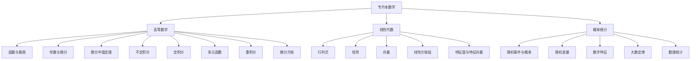

# 📚 专升本数学高效学习笔记

  <strong>专为专升本考生设计 | 系统全面 | 通俗易懂 | 实用高效</strong>

---

## 🎯 使用说明

### 📖 笔记特点
- ✅ **结构清晰**：按照专升本数学标准大纲组织
- ✅ **内容全面**：涵盖高数、线代、概率统计三门课程
- ✅ **通俗易懂**：用简单语言解释复杂概念
- ✅ **实例丰富**：每个知识点都配有详细示例
- ✅ **练习充分**：每章都配有精选练习题
- ✅ **答案完整**：所有练习题都有详细解答
- ✅ **记忆技巧**：提供高效记忆方法和口诀
- ✅ **考试技巧**：包含专升本考试常见题型和解题策略

### 🔍 学习建议
1. **系统学习**：按章节顺序学习，打好基础
2. **理解为主**：不要死记硬背，理解公式背后的含义
3. **勤做练习**：学完一章后立即做对应练习题
4. **定期复习**：每周回顾已学内容，巩固记忆
5. **模拟测试**：每月进行一次模拟考试，检验学习效果

### ⏰ 学习计划参考
- **第一阶段（1-2个月）**：完成高等数学部分
- **第二阶段（1个月）**：完成线性代数部分  
- **第三阶段（1个月）**：完成概率统计部分
- **第四阶段（1个月）**：总复习和模拟考试

---

## 📋 目录索引

<strong>📊 第一部分：高等数学（点击展开）</strong>

### 第一章 函数与极限
- 1.1 函数的概念与性质
- 1.2 初等函数
- 1.3 数列的极限
- 1.4 函数的极限
- 1.5 无穷小与无穷大
- 1.6 极限运算法则
- 1.7 两个重要极限
- 1.8 无穷小的比较
- 1.9 函数的连续性

### 第二章 导数与微分
- 2.1 导数的概念
- 2.2 函数的求导法则
- 2.3 高阶导数
- 2.4 隐函数与参数方程求导
- 2.5 函数的微分
- 2.6 微分在近似计算中的应用

### 第三章 微分中值定理与导数的应用
- 3.1 微分中值定理
- 3.2 洛必达法则
- 3.3 泰勒公式
- 3.4 函数的单调性与极值
- 3.5 函数的凹凸性与拐点
- 3.6 函数图形的描绘
- 3.7 最值问题

### 第四章 不定积分
- 4.1 不定积分的概念与性质
- 4.2 换元积分法
- 4.3 分部积分法
- 4.4 有理函数的积分
- 4.5 三角函数有理式的积分

### 第五章 定积分
- 5.1 定积分的概念与性质
- 5.2 微积分基本定理
- 5.3 定积分的换元法
- 5.4 定积分的分部积分法
- 5.5 广义积分
- 5.6 定积分的应用

### 第六章 多元函数微分学
- 6.1 多元函数的基本概念
- 6.2 偏导数
- 6.3 全微分
- 6.4 多元复合函数求导
- 6.5 隐函数求导
- 6.6 多元函数的极值

### 第七章 重积分
- 7.1 二重积分的概念与性质
- 7.2 二重积分的计算
- 7.3 三重积分简介

### 第八章 微分方程
- 8.1 微分方程的基本概念
- 8.2 一阶微分方程
- 8.3 可降阶的高阶微分方程
- 8.4 二阶常系数线性微分方程

<strong>📈 第二部分：线性代数（点击展开）</strong>

### 第一章 行列式
### 第二章 矩阵
### 第三章 向量
### 第四章 线性方程组
### 第五章 矩阵的特征值与特征向量

<strong>📊 第三部分：概率统计（点击展开）</strong>

### 第一章 随机事件与概率
### 第二章 随机变量及其分布
### 第三章 多维随机变量
### 第四章 随机变量的数字特征
### 第五章 大数定律与中心极限定理
### 第六章 数理统计基础

---

## 🧠 专升本数学知识体系图

## 📊 专升本数学考试分析

### 🎯 考试特点
- **题型分布**：选择题(40%) + 填空题(20%) + 解答题(40%)
- **难度比例**：基础题(60%) + 中等题(30%) + 难题(10%)
- **高频考点**：极限计算、导数应用、积分计算、线性方程组

### ⏰ 时间分配建议
| 题型 | 题量 | 建议时间 | 策略 |
|------|------|----------|------|
| 选择题 | 8题 | 20分钟 | 快速判断，排除法 |
| 填空题 | 4题 | 15分钟 | 直接计算，注意格式 |
| 解答题 | 4题 | 55分钟 | 步骤清晰，分步得分 |

### 💯 得分技巧
1. **选择题**：特殊值法、排除法、图形法
2. **填空题**：结果精确，注意单位
3. **解答题**：步骤完整，公式写对也有分

---

## 🎓 快速查阅表

### 📝 常用数学符号
| 符号 | 含义 | 示例 |
|------|------|------|
| $\lim$ | 极限 | $\lim_{x \to 0} \frac{\sin x}{x} = 1$ |
| $\frac{dy}{dx}$ | 导数 | $\frac{d}{dx}(x^2) = 2x$ |
| $\int$ | 积分 | $\int x dx = \frac{1}{2}x^2 + C$ |
| $\sum$ | 求和 | $\sum_{i=1}^n i = \frac{n(n+1)}{2}$ |
| $\prod$ | 乘积 | $\prod_{i=1}^n i = n!$ |

### 🔢 重要常数
- $\pi \approx 3.1415926535$
- $e \approx 2.7182818284$
- $\sqrt{2} \approx 1.4142135623$
- $\sqrt{3} \approx 1.7320508075$

### 🧮 常用公式速查
1. **二次方程求根**：$x = \frac{-b \pm \sqrt{b^2-4ac}}{2a}$
2. **三角函数关系**：$\sin^2 x + \cos^2 x = 1$
3. **导数公式**：$(x^n)' = nx^{n-1}$
4. **积分公式**：$\int x^n dx = \frac{x^{n+1}}{n+1} + C$（$n \neq -1$）

---

## 🧠 记忆技巧与口诀

### 🔄 极限计算口诀
> **"先代入，再化简，洛必达，泰勒展"**
> 1. 先尝试直接代入
> 2. 不能代入就化简
> 3. 0/0或∞/∞用洛必达
> 4. 复杂极限用泰勒展开

### 📏 导数计算口诀
> **"幂指对，三角反，复合链，隐函导"**
> 1. 幂函数、指数、对数记住公式
> 2. 三角函数、反三角函数记住公式
> 3. 复合函数用链式法则
> 4. 隐函数用隐函数求导法

### 📐 积分计算口诀
> **"凑微分，换元法，分部积，有理分"**
> 1. 先看能否凑微分
> 2. 根式、三角用换元
> 3. 乘积形式用分部
> 4. 有理函数拆部分

---

  <h2>📚 第一部分：高等数学</h2>

## 第一章 函数与极限

### 🎯 本章重点
- 理解函数的概念和性质
- 掌握极限的计算方法
- 理解连续性的概念

### ⚠️ 易错点提醒
1. **极限不存在的情况**：左右极限不相等、无穷振荡
2. **连续性判断**：分段函数在分段点处要特别注意
3. **无穷小的比较**：注意高阶、低阶、同阶、等价的区别

---

## 1.1 函数的概念与性质

### 📖 核心概念

**函数的定义**
> 设 $x$ 和 $y$ 是两个变量，$D$ 是一个非空数集。如果对于 $D$ 中的每一个 $x$，按照某种对应法则 $f$，都有唯一确定的 $y$ 值与之对应，则称 $y$ 是 $x$ 的**函数**，记作：
> $$ y = f(x), \quad x \in D $$

**记忆技巧**：函数就像一台"自动售货机"——投入$x$（输入），得到唯一的$y$（输出）。

### 🔍 函数的四要素
1. **定义域**：自变量 $x$ 的取值范围
2. **值域**：因变量 $y$ 的取值范围  
3. **对应法则**：$x$ 与 $y$ 的对应关系
4. **函数关系**：$y$ 对 $x$ 的依赖关系

### 📊 函数的性质

| 性质 | 定义 | 判断方法 | 示例 |
|------|------|----------|------|
| **有界性** | 存在 $M>0$，使 $|f(x)| \leq M$ | 找上下界 | $y=\sin x$ 有界 |
| **单调性** | $x_1<x_2 \Rightarrow f(x_1)\leq f(x_2)$（增） | 求导数符号 | $y=x^2$ 在 $(0,+\infty)$ 单调增 |
| **奇偶性** | $f(-x)=f(x)$（偶） $f(-x)=-f(x)$（奇） | 代入 $-x$ 检验 | $y=x^2$ 偶，$y=x^3$ 奇 |
| **周期性** | 存在 $T\neq 0$，使 $f(x+T)=f(x)$ | 找最小正周期 | $y=\sin x$ 周期 $2\pi$ |

### 💡 实用技巧
- **奇偶性判断口诀**："偶对偶，奇对奇，奇偶混合为奇"
- **单调性记忆**：导数>0递增，导数<0递减
- **周期性应用**：三角函数、周期函数积分可简化

---

## 1.2 初等函数

### 📚 基本初等函数家族

| 函数类型 | 一般形式 | 图像特点 | 定义域 | 值域 |
|----------|----------|----------|--------|------|
| **幂函数** | $y = x^\alpha$ | $\alpha>0$过(0,0),(1,1) $\alpha<0$不过(0,0) | 看$\alpha$ | 看$\alpha$ |
| **指数函数** | $y = a^x$ ($a>0,a\neq1$) | $a>1$增，$0<a<1$减 过(0,1)点 | $(-\infty,+\infty)$ | $(0,+\infty)$ |
| **对数函数** | $y = \log_a x$ | $a>1$增，$0<a<1$减 过(1,0)点 | $(0,+\infty)$ | $(-\infty,+\infty)$ |
| **三角函数** | $y=\sin x,\cos x,\tan x$ | 周期性，有界性 | 看具体函数 | 看具体函数 |
| **反三角函数** | $y=\arcsin x,\arccos x,\arctan x$ | 单调性，有界性 | 看具体函数 | 看具体函数 |

### 🎨 函数图像记忆法
1. **幂函数**：指数$\alpha$决定"陡缓"
2. **指数函数**：底数$a$决定"增减"
3. **对数函数**：指数函数的"镜像"
4. **三角函数**：记住基本周期和形状
5. **反三角函数**：三角函数的"逆映射"

### 🔄 初等函数变换
- **平移**：$f(x) \to f(x-a)$ 右移$a$单位
- **伸缩**：$f(x) \to f(ax)$ 横向压缩$a$倍
- **翻折**：$f(x) \to f(-x)$ 关于y轴对称
- **上下移动**：$f(x) \to f(x)+b$ 上移$b$单位

---

## 1.3 数列的极限

### 🎯 核心概念

**数列极限的定义**（$\varepsilon$-$N$语言）
> 设 $\{x_n\}$ 是一个数列，$a$ 是一个常数。如果对于任意给定的正数 $\varepsilon$，总存在正整数 $N$，使得当 $n > N$ 时，有：
> $$ |x_n - a| < \varepsilon $$
> 则称数列 $\{x_n\}$ **收敛**于 $a$，记作 $\lim_{n \to \infty} x_n = a$。

### 💡 理解技巧
把 $\varepsilon$ 想象成"误差要求"，$N$ 是"从第几项开始"能满足误差要求。

### 📊 极限的性质

| 性质 | 内容 | 应用 |
|------|------|------|
| **唯一性** | 极限若存在，则唯一 | 验证极限 |
| **有界性** | 收敛数列必有界 | 判断发散 |
| **保号性** | $\lim x_n = a > 0$，则存在 $N$，$n>N$ 时 $x_n>0$ | 不等式证明 |
| **夹逼准则** | 若 $a_n \leq b_n \leq c_n$，且 $\lim a_n = \lim c_n = L$，则 $\lim b_n = L$ | 求复杂极限 |

### 🧮 常见数列极限
1. $\lim_{n \to \infty} \frac{1}{n} = 0$
2. $\lim_{n \to \infty} q^n = 0$（$|q|<1$）
3. $\lim_{n \to \infty} \left(1 + \frac{1}{n}\right)^n = e$（**重要极限**）
4. $\lim_{n \to \infty} \sqrt[n]{n} = 1$
5. $\lim_{n \to \infty} \frac{n^a}{b^n} = 0$（$b>1$，$a$任意）

### ⚠️ 易错点
- 数列极限是 $n \to \infty$，不是 $x \to something$
- 收敛数列一定有界，但有界数列不一定收敛
- 单调有界数列必收敛（重要定理）

---

## 1.4 函数的极限

### 📖 函数极限的定义

**$x \to x_0$ 时的极限**
> 设函数 $f(x)$ 在点 $x_0$ 的某个去心邻域内有定义，$A$ 是一个常数。如果对于任意给定的正数 $\varepsilon$，总存在正数 $\delta$，使得当 $0 < |x - x_0| < \delta$ 时，有：
> $$ |f(x) - A| < \varepsilon $$
> 则称当 $x \to x_0$ 时，$f(x)$ 的极限为 $A$，记作 $\lim_{x \to x_0} f(x) = A$。

### 🔄 单侧极限
- **右极限**：$\lim_{x \to x_0^+} f(x) = A$（从右侧逼近）
- **左极限**：$\lim_{x \to x_0^-} f(x) = A$（从左侧逼近）

**极限存在定理**：$\lim_{x \to x_0} f(x)$ 存在 ⇔ 左右极限存在且相等。

### 📊 函数极限的性质

| 性质 | 公式 | 说明 |
|------|------|------|
| **唯一性** | 极限若存在则唯一 | 同数列 |
| **局部有界性** | 若极限存在，则在某邻域内有界 | 局部性质 |
| **局部保号性** | 若 $\lim_{x \to x_0} f(x) = A > 0$，则存在 $\delta>0$，当 $0<|x-x_0|<\delta$ 时 $f(x)>0$ | 不等式证明 |
| **四则运算法则** | $\lim [f(x) \pm g(x)] = \lim f(x) \pm \lim g(x)$ 等 | 前提是各部分极限存在 |

### 🧠 极限计算步骤
1. **代入法**：直接代入 $x_0$，如果不出现 $\frac{0}{0}$、$\frac{\infty}{\infty}$ 等未定式，则极限等于函数值
2. **因式分解**：针对 $\frac{0}{0}$ 型，分解因式约分
3. **有理化**：针对含根式的 $\frac{0}{0}$ 型
4. **等价无穷小替换**：简化计算
5. **洛必达法则**：对 $\frac{0}{0}$ 或 $\frac{\infty}{\infty}$ 型

### 💡 实用技巧
- **分段函数极限**：在分段点处必须分别求左右极限
- **绝对值函数**：注意绝对值的分段定义
- **复合函数极限**：$\lim_{x \to x_0} f[g(x)] = f[\lim_{x \to x_0} g(x)]$（$f$在极限点连续）

---

## 1.5 无穷小与无穷大

### 🔍 概念对比

| 概念 | 定义 | 符号 | 性质 |
|------|------|------|------|
| **无穷小量** | $\lim_{x \to x_0} \alpha(x) = 0$ | $\alpha(x)$ | 1. 有限个无穷小的和、差、积仍是无穷小 2. 有界函数×无穷小=无穷小 |
| **无穷大量** | $\lim_{x \to x_0} f(x) = \infty$ | $f(x)$ | 1. 两个无穷大的和、积仍是无穷大 2. 有界函数+无穷大=无穷大 |

### 🔗 无穷小与无穷大的关系
- 如果 $f(x)$ 是无穷大，则 $\frac{1}{f(x)}$ 是无穷小（$f(x) \neq 0$）
- 如果 $\alpha(x)$ 是无穷小且 $\alpha(x) \neq 0$，则 $\frac{1}{\alpha(x)}$ 是无穷大

### ⚠️ 注意事项
1. 无穷小不是"很小的数"，而是极限为0的变量
2. 无穷大不是"很大的数"，而是极限为∞的变量
3. 两个无穷小的商可能是0、常数、∞或其他，需要具体分析

---

## 1.6 极限运算法则

### 📝 基本运算法则
设 $\lim f(x) = A$，$\lim g(x) = B$，则：

1. **和差法则**：$\lim [f(x) \pm g(x)] = A \pm B$
2. **乘积法则**：$\lim [f(x) \cdot g(x)] = A \cdot B$
3. **商法则**：$\lim \frac{f(x)}{g(x)} = \frac{A}{B}$（$B \neq 0$）
4. **常数倍法则**：$\lim [c \cdot f(x)] = c \cdot A$（$c$为常数）

### 🧮 复合函数极限
设 $\lim_{x \to x_0} g(x) = u_0$，且 $f(u)$ 在 $u_0$ 连续，则：
$$ \lim_{x \to x_0} f[g(x)] = f[\lim_{x \to x_0} g(x)] = f(u_0) $$

### ⚠️ 使用条件
- 各部分极限必须存在
- 商的极限要求分母极限不为0
- 复合函数要求外层函数在极限点连续

### 💡 计算技巧
当遇到 $\infty - \infty$、$0 \cdot \infty$、$\frac{\infty}{\infty}$、$\frac{0}{0}$ 等未定式时：
1. 通分、有理化、因式分解
2. 提取最高次项
3. 使用洛必达法则
4. 使用泰勒展开

---

## 1.7 两个重要极限

### 🎯 第一重要极限
$$ \lim_{x \to 0} \frac{\sin x}{x} = 1 $$

**记忆口诀**："正弦比角度，极限等于1"

**推广形式**：
$$ \lim_{\square \to 0} \frac{\sin \square}{\square} = 1 $$

**应用示例**：
1. $\lim_{x \to 0} \frac{\sin 3x}{x} = 3$
2. $\lim_{x \to 0} \frac{\tan x}{x} = 1$
3. $\lim_{x \to 0} \frac{1 - \cos x}{x^2} = \frac{1}{2}$

### 🎯 第二重要极限
$$ \lim_{x \to \infty} \left(1 + \frac{1}{x}\right)^x = e $$

**记忆口诀**："1加x分之一的x次，极限等于e"

**推广形式**：
$$ \lim_{\square \to 0} (1 + \square)^{\frac{1}{\square}} = e $$

**变形公式**：
1. $\lim_{x \to 0} (1 + x)^{\frac{1}{x}} = e$
2. $\lim_{x \to \infty} \left(1 + \frac{a}{x}\right)^{bx} = e^{ab}$
3. $\lim_{x \to 0} \frac{\ln(1+x)}{x} = 1$
4. $\lim_{x \to 0} \frac{e^x - 1}{x} = 1$

### 📊 重要极限应用总结

| 类型 | 公式 | 记忆技巧 |
|------|------|----------|
| 三角型 | $\lim_{x \to 0} \frac{\sin x}{x} = 1$ | "正弦小角比自身" |
| 指数型 | $\lim_{x \to \infty} (1+\frac{1}{x})^x = e$ | "1加倒数的自身次" |
| 对数型 | $\lim_{x \to 0} \frac{\ln(1+x)}{x} = 1$ | "ln(1+小)比小" |
| 指数差型 | $\lim_{x \to 0} \frac{e^x-1}{x} = 1$ | "e的小次减1比小" |

---

## 1.8 无穷小的比较

### 📈 比较等级
设 $\alpha$ 和 $\beta$ 都是 $x \to x_0$ 时的无穷小：

| 关系 | 定义 | 符号 | 说明 |
|------|------|------|------|
| **高阶无穷小** | $\lim \frac{\alpha}{\beta} = 0$ | $\alpha = o(\beta)$ | $\alpha$ 比 $\beta$ 更快趋于0 |
| **低阶无穷小** | $\lim \frac{\alpha}{\beta} = \infty$ | - | $\alpha$ 比 $\beta$ 更慢趋于0 |
| **同阶无穷小** | $\lim \frac{\alpha}{\beta} = c \neq 0$ | $\alpha = O(\beta)$ | $\alpha$ 与 $\beta$ 趋于0速度相当 |
| **等价无穷小** | $\lim \frac{\alpha}{\beta} = 1$ | $\alpha \sim \beta$ | $\alpha$ 与 $\beta$ 趋于0速度相同 |

### 📚 常用等价无穷小（$x \to 0$ 时）

| 等价关系 | 记忆口诀 |
|----------|----------|
| $\sin x \sim x$ | "正弦小角等自身" |
| $\tan x \sim x$ | "正切小角等自身" |
| $\arcsin x \sim x$ | "反正弦小角等自身" |
| $\arctan x \sim x$ | "反正切小角等自身" |
| $1 - \cos x \sim \frac{1}{2}x^2$ | "1减余弦等半方" |
| $\ln(1+x) \sim x$ | "ln(1+小)等自身" |
| $e^x - 1 \sim x$ | "e的小次减1等自身" |
| $(1+x)^\alpha - 1 \sim \alpha x$ | "(1+小)的α次减1等α倍" |

### ⚠️ 使用规则
1. **乘除可用，加减慎用**：等价无穷小在乘除运算中可以直接替换，但在加减运算中一般不能直接替换
2. **精度匹配**：替换后的无穷小阶数要与原式保持一致
3. **复合函数**：对于复合函数，内层函数趋于0时也可使用

### 💡 实用技巧
- **加减运算处理**：如果加减后不是0，可以用泰勒展开保留足够项
- **幂指函数**：先取对数，再用等价无穷小
- **验证方法**：计算 $\lim \frac{\alpha}{\beta}$ 看是否等于1

---

## 1.9 函数的连续性

### 🎯 连续性定义
> 设函数 $f(x)$ 在点 $x_0$ 的某个邻域内有定义，如果：
> $$ \lim_{x \to x_0} f(x) = f(x_0) $$
> 则称 $f(x)$ 在点 $x_0$ 处**连续**。

### 🔍 连续的三要素
1. $f(x_0)$ 有定义
2. $\lim_{x \to x_0} f(x)$ 存在
3. 极限值等于函数值

### 📊 间断点分类

| 类型 | 定义 | 示例 |
|------|------|------|
| **第一类间断点** （左右极限都存在） | 可去间断点：左右极限相等但不等于函数值 跳跃间断点：左右极限不相等 | $f(x)=\frac{\sin x}{x}$ 在 $x=0$ $f(x)=\begin{cases}1 & x>0\\-1 & x<0\end{cases}$ 在 $x=0$ |
| **第二类间断点** （至少一侧极限不存在） | 无穷间断点：至少一侧极限为∞ 振荡间断点：极限振荡不存在 | $f(x)=\frac{1}{x}$ 在 $x=0$ $f(x)=\sin\frac{1}{x}$ 在 $x=0$ |

### 📈 连续函数的性质

| 性质 | 内容 | 应用 |
|------|------|------|
| **有界性定理** | 闭区间上连续函数必有界 | 证明函数有界 |
| **最值定理** | 闭区间上连续函数必有最大值和最小值 | 求最值问题 |
| **介值定理** | 设 $f(x)$ 在 $[a,b]$ 上连续，$f(a) \neq f(b)$，则对于任意介于 $f(a)$ 和 $f(b)$ 之间的 $C$，存在 $\xi \in (a,b)$ 使 $f(\xi)=C$ | 证明根的存在性 |
| **零点定理** | 如果 $f(a) \cdot f(b) < 0$，则存在 $\xi \in (a,b)$ 使 $f(\xi)=0$ | 证明方程有根 |

### 💡 连续性判断技巧
1. **初等函数**：在其定义区间内都连续
2. **分段函数**：在分段点处需要验证连续性
3. **复合函数**：外层连续，内层连续，则复合函数连续
4. **四则运算**：连续函数的和、差、积、商（分母不为0）仍连续

### ⚠️ 易错点
- 函数在一点连续要求该点有定义
- 分段函数在分段点处的连续性需要验证左右极限
- 无穷间断点和振荡间断点都是第二类间断点

---

## 📝 第一章练习题

### 基础题
1. **求极限**：$\lim_{x \to 0} \frac{\sin 3x}{\sin 5x}$
   - **提示**：使用第一重要极限或等价无穷小

2. **求极限**：$\lim_{x \to \infty} \left(1 - \frac{2}{x}\right)^x$
   - **提示**：化为第二重要极限形式

3. **判断连续性**：$f(x) = \frac{x^2-1}{x-1}$ 在 $x=1$ 处是否连续？如不连续，是什么类型间断点？
   - **提示**：先化简函数

4. **求极限**：$\lim_{x \to 0} \frac{\tan x - \sin x}{x^3}$
   - **提示**：使用泰勒展开或等价无穷小

### 提高题
5. **证明题**：证明方程 $x^3 - 3x + 1 = 0$ 在区间 $(0,1)$ 内至少有一个实根。
   - **提示**：使用零点定理

6. **综合题**：设 $f(x) = \begin{cases} 
   \frac{\sin 2x}{x} & x \neq 0 \\
   a & x = 0 
   \end{cases}$
   问 $a$ 取何值时，$f(x)$ 在 $x=0$ 处连续？
   - **提示**：计算 $\lim_{x \to 0} f(x)$

---

## 🔑 第一章答案与解析

### 基础题解析
1. **$\lim_{x \to 0} \frac{\sin 3x}{\sin 5x} = \frac{3}{5}$**
   - **解析**：$\frac{\sin 3x}{\sin 5x} = \frac{\sin 3x}{3x} \cdot \frac{5x}{\sin 5x} \cdot \frac{3}{5} \to 1 \cdot 1 \cdot \frac{3}{5} = \frac{3}{5}$

2. **$\lim_{x \to \infty} \left(1 - \frac{2}{x}\right)^x = e^{-2}$**
   - **解析**：令 $t = -\frac{x}{2}$，则原式 $= \lim_{t \to \infty} \left(1 + \frac{1}{t}\right)^{-2t} = \left[\lim_{t \to \infty} \left(1 + \frac{1}{t}\right)^t\right]^{-2} = e^{-2}$

3. **$x=1$ 是可去间断点**
   - **解析**：$f(x) = \frac{x^2-1}{x-1} = x+1$（$x \neq 1$），$\lim_{x \to 1} f(x) = 2$，但 $f(1)$ 无定义。补充定义 $f(1)=2$ 后函数连续。

4. **$\lim_{x \to 0} \frac{\tan x - \sin x}{x^3} = \frac{1}{2}$**
   - **解析**：$\tan x - \sin x = \frac{\sin x}{\cos x} - \sin x = \sin x \left(\frac{1-\cos x}{\cos x}\right) \sim x \cdot \frac{\frac{1}{2}x^2}{1} = \frac{1}{2}x^3$

### 提高题解析
5. **证明**：设 $f(x) = x^3 - 3x + 1$，则 $f(0)=1>0$，$f(1)=-1<0$。由零点定理，存在 $\xi \in (0,1)$ 使 $f(\xi)=0$。

6. **$a=2$ 时连续**
   - **解析**：$\lim_{x \to 0} f(x) = \lim_{x \to 0} \frac{\sin 2x}{x} = 2\lim_{x \to 0} \frac{\sin 2x}{2x} = 2$。要使 $f(x)$ 在 $x=0$ 连续，需 $a=2$。

---

  <h3>🎉 恭喜完成第一章学习！</h3>
  
函数与极限是微积分的基础，务必掌握扎实！

---

> **下一章预告**：第二章 导数与微分——学习变化率与微分计算

---

  <h2>📈 第二章 导数与微分</h2>

## 🎯 本章重点
- 理解导数的概念和几何意义
- 掌握各种求导法则和公式
- 会求高阶导数、隐函数导数和参数方程导数
- 理解微分的概念和应用

### ⚠️ 易错点提醒
1. **复合函数求导**：容易漏掉内层函数的导数
2. **隐函数求导**：忘记$y$是$x$的函数，求导时漏掉$y'$
3. **高阶导数**：注意公式的规律性
4. **微分计算**：微分是$f'(x)dx$，不要漏掉$dx$

---

## 2.1 导数的概念

### 📖 核心概念

**导数的定义**
> 设函数 $y = f(x)$ 在点 $x_0$ 的某个邻域内有定义，当自变量 $x$ 在 $x_0$ 处取得增量 $\Delta x$（点 $x_0 + \Delta x$ 仍在该邻域内）时，相应的函数增量 $\Delta y = f(x_0 + \Delta x) - f(x_0)$。如果极限
> $$ \lim_{\Delta x \to 0} \frac{\Delta y}{\Delta x} = \lim_{\Delta x \to 0} \frac{f(x_0 + \Delta x) - f(x_0)}{\Delta x} $$
> 存在，则称函数 $f(x)$ 在点 $x_0$ 处**可导**，并称这个极限值为 $f(x)$ 在点 $x_0$ 处的**导数**。

**导数的四种表示**：
- $f'(x_0)$
- $y'|_{x=x_0}$
- $\frac{dy}{dx}|_{x=x_0}$
- $\frac{df(x)}{dx}|_{x=x_0}$

### 🎨 导数的几何意义
函数 $y = f(x)$ 在点 $(x_0, f(x_0))$ 处的导数 $f'(x_0)$ 表示曲线在该点的**切线斜率**。

**切线方程**：
$$ y - f(x_0) = f'(x_0)(x - x_0) $$

**法线方程**（当 $f'(x_0) \neq 0$ 时）：
$$ y - f(x_0) = -\frac{1}{f'(x_0)}(x - x_0) $$

### 🔗 可导与连续的关系
- **可导必连续**：如果函数在某点可导，则在该点一定连续
- **连续不一定可导**：函数在某点连续，但在该点可能不可导

**典型反例**：$f(x) = |x|$ 在 $x=0$ 处连续但不可导

### 📊 单侧导数
- **右导数**：$f'_+(x_0) = \lim_{x \to x_0^+} \frac{f(x) - f(x_0)}{x - x_0}$
- **左导数**：$f'_-(x_0) = \lim_{x \to x_0^-} \frac{f(x) - f(x_0)}{x - x_0}$

**导数存在定理**：$f'(x_0)$ 存在 ⇔ 左右导数存在且相等。

### 💡 实用技巧
- **导数计算步骤**：
  1. 求增量 $\Delta y = f(x_0 + \Delta x) - f(x_0)$
  2. 算比值 $\frac{\Delta y}{\Delta x}$
  3. 取极限 $\lim_{\Delta x \to 0} \frac{\Delta y}{\Delta x}$

- **分段函数在分段点处的可导性**：必须分别求左右导数

### 🧮 示例演示

**示例1**：求 $f(x) = x^2$ 在 $x=1$ 处的导数
1. $\Delta y = (1+\Delta x)^2 - 1^2 = 2\Delta x + (\Delta x)^2$
2. $\frac{\Delta y}{\Delta x} = 2 + \Delta x$
3. $\lim_{\Delta x \to 0} (2 + \Delta x) = 2$
∴ $f'(1) = 2$

**示例2**：证明 $f(x) = |x|$ 在 $x=0$ 处不可导
- 右导数：$\lim_{x \to 0^+} \frac{|x| - 0}{x-0} = \lim_{x \to 0^+} \frac{x}{x} = 1$
- 左导数：$\lim_{x \to 0^-} \frac{|x| - 0}{x-0} = \lim_{x \to 0^-} \frac{-x}{x} = -1$
左右导数不相等，所以不可导。

---

## 2.2 函数的求导法则

### 📚 基本导数公式（必须牢记！）

| 函数类型 | 公式 | 记忆口诀 |
|----------|------|----------|
| **常数** | $(c)' = 0$ | "常数导零" |
| **幂函数** | $(x^\alpha)' = \alpha x^{\alpha-1}$ | "幂降一次，原幂当系数" |
| **指数函数** | $(a^x)' = a^x \ln a$ $(e^x)' = e^x$ | "指数照抄，乘个ln底" "e的x次导自身" |
| **对数函数** | $(\log_a x)' = \frac{1}{x \ln a}$ $(\ln x)' = \frac{1}{x}$ | "1比x再比ln底" "ln x导得x分之一" |
| **三角函数** | $(\sin x)' = \cos x$ $(\cos x)' = -\sin x$ $(\tan x)' = \sec^2 x$ $(\cot x)' = -\csc^2 x$ | "正弦导余弦，余弦导负正弦" "正切导正割方，余切导负余割方" |

### 🔄 求导法则

| 法则 | 公式 | 记忆技巧 |
|------|------|----------|
| **和差法则** | $(u \pm v)' = u' \pm v'$ | "和的导数等于导数的和" |
| **乘积法则** | $(uv)' = u'v + uv'$ | "前导后不导 + 前不导后导" |
| **商法则** | $\left(\frac{u}{v}\right)' = \frac{u'v - uv'}{v^2}$（$v \neq 0$） | "上导下不导减上不导下导，除以分母平方" |
| **常数倍法则** | $(cu)' = cu'$（$c$为常数） | "常数可以提出来" |

### 🔗 复合函数求导（链式法则）

**链式法则**：
设 $y = f(u)$，$u = g(x)$，则复合函数 $y = f[g(x)]$ 的导数为：
$$ \frac{dy}{dx} = \frac{dy}{du} \cdot \frac{du}{dx} \quad \text{或} \quad y'_x = f'(u) \cdot g'(x) $$

**记忆口诀**："外层导乘内层导"

**步骤**：
1. 识别内外层函数
2. 分别求导
3. 相乘

### 🧮 示例演示

**示例1**：求 $y = \sin(3x+2)$ 的导数
- 外层：$\sin u$，导数为 $\cos u$
- 内层：$u = 3x+2$，导数为 $3$
- 结果：$y' = \cos(3x+2) \cdot 3 = 3\cos(3x+2)$

**示例2**：求 $y = e^{x^2}$ 的导数
- 外层：$e^u$，导数为 $e^u$
- 内层：$u = x^2$，导数为 $2x$
- 结果：$y' = e^{x^2} \cdot 2x = 2x e^{x^2}$

### 💡 求导技巧总结
1. **先化简后求导**：表达式越简单，求导越容易
2. **复合函数分解**：从外到内层层分解
3. **分段函数**：分段点处用定义求导
4. **绝对值函数**：化为分段函数处理

---

## 2.3 高阶导数

### 📖 高阶导数概念

**定义**：
- **二阶导数**：一阶导数的导数，记作 $y''$, $f''(x)$, $\frac{d^2 y}{dx^2}$
- **$n$阶导数**：$(n-1)$阶导数的导数，记作 $y^{(n)}$, $f^{(n)}(x)$, $\frac{d^n y}{dx^n}$

### 📚 常见函数的高阶导数公式

| 函数 | $n$阶导数公式 | 规律 |
|------|---------------|------|
| $x^m$（$m$为自然数） | $(x^m)^{(n)} = \begin{cases} \frac{m!}{(m-n)!}x^{m-n} & n \leq m \\ 0 & n > m \end{cases}$ | 连乘降幂 |
| $e^x$ | $(e^x)^{(n)} = e^x$ | 不变 |
| $a^x$ | $(a^x)^{(n)} = a^x (\ln a)^n$ | 乘$(\ln a)^n$ |
| $\sin x$ | $(\sin x)^{(n)} = \sin\left(x + \frac{n\pi}{2}\right)$ | 每求一次导，相位增加$\frac{\pi}{2}$ |
| $\cos x$ | $(\cos x)^{(n)} = \cos\left(x + \frac{n\pi}{2}\right)$ | 同上 |
| $\ln x$ | $(\ln x)^{(n)} = (-1)^{n-1} \frac{(n-1)!}{x^n}$ | 符号交替，阶乘在分子 |

### 🧮 莱布尼茨公式

**乘积的$n$阶导数**：
$$ (uv)^{(n)} = \sum_{k=0}^n C_n^k u^{(n-k)} v^{(k)} $$

**记忆**：类似二项式定理，$u$的导数阶数递减，$v$的导数阶数递增。

### 💡 高阶导数求法技巧
1. **直接法**：逐次求导，观察规律
2. **公式法**：利用已知的高阶导数公式
3. **莱布尼茨公式**：用于乘积函数
4. **泰勒展开**：通过泰勒展开的系数求高阶导数

### 🧮 示例演示

**示例**：求 $y = x^2 e^x$ 的二阶导数
1. 一阶导数：$y' = 2x e^x + x^2 e^x = e^x(x^2 + 2x)$
2. 二阶导数：$y'' = e^x(x^2 + 2x) + e^x(2x + 2) = e^x(x^2 + 4x + 2)$

---

## 2.4 隐函数与参数方程求导

### 🔍 隐函数求导

**概念**：由方程 $F(x, y) = 0$ 确定的函数 $y = y(x)$ 称为隐函数。

**求导方法**：
1. 方程两边同时对 $x$ 求导
2. 注意 $y$ 是 $x$ 的函数，$y$ 的函数求导要用链式法则
3. 解出 $y'$

**示例**：求由 $x^2 + y^2 = 1$ 确定的隐函数的导数
- 两边对 $x$ 求导：$2x + 2yy' = 0$
- 解出：$y' = -\frac{x}{y}$

### 📝 对数求导法

**适用情况**：
1. 幂指函数：$y = u(x)^{v(x)}$
2. 连乘除函数：$y = \frac{(x-1)(x-2)}{(x-3)(x-4)}$

**步骤**：
1. 两边取自然对数：$\ln y = v(x) \ln u(x)$
2. 两边对 $x$ 求导：$\frac{y'}{y} = v'(x) \ln u(x) + v(x) \frac{u'(x)}{u(x)}$
3. 解出 $y'$：$y' = y \left[ v'(x) \ln u(x) + v(x) \frac{u'(x)}{u(x)} \right]$

### 📈 参数方程求导

**参数方程**：$\begin{cases} x = \varphi(t) \\ y = \psi(t) \end{cases}$

**一阶导数**：
$$ \frac{dy}{dx} = \frac{\frac{dy}{dt}}{\frac{dx}{dt}} = \frac{\psi'(t)}{\varphi'(t)} $$

**二阶导数**：
$$ \frac{d^2 y}{dx^2} = \frac{d}{dx}\left(\frac{dy}{dx}\right) = \frac{\frac{d}{dt}\left(\frac{dy}{dx}\right)}{\frac{dx}{dt}} = \frac{\frac{d}{dt}\left(\frac{\psi'(t)}{\varphi'(t)}\right)}{\varphi'(t)} $$

### 🧮 示例演示

**示例**：求摆线 $\begin{cases} x = a(t - \sin t) \\ y = a(1 - \cos t) \end{cases}$ 的导数
- $\frac{dx}{dt} = a(1 - \cos t)$，$\frac{dy}{dt} = a\sin t$
- $\frac{dy}{dx} = \frac{a\sin t}{a(1 - \cos t)} = \frac{\sin t}{1 - \cos t} = \cot\frac{t}{2}$

---

## 2.5 函数的微分

### 📖 微分概念

**定义**：设函数 $y = f(x)$ 在点 $x_0$ 处可导，则增量
$$ \Delta y = f'(x_0) \Delta x + o(\Delta x) $$
其中 $f'(x_0) \Delta x$ 称为函数在点 $x_0$ 处的**微分**，记作：
$$ dy = f'(x_0) dx \quad \text{或} \quad df(x_0) = f'(x_0) dx $$
其中 $dx = \Delta x$ 称为自变量的微分。

### 🔄 微分公式

| 函数 | 微分 | 记忆 |
|------|------|------|
| $c$（常数） | $d(c) = 0$ | 常数微分为0 |
| $x^\alpha$ | $d(x^\alpha) = \alpha x^{\alpha-1} dx$ | 幂函数微分 |
| $a^x$ | $d(a^x) = a^x \ln a \cdot dx$ | 指数函数微分 |
| $\sin x$ | $d(\sin x) = \cos x \cdot dx$ | 三角函数微分 |
| 四则运算 | $d(u \pm v) = du \pm dv$ $d(uv) = v du + u dv$ $d\left(\frac{u}{v}\right) = \frac{v du - u dv}{v^2}$ | 与导数法则对应 |

### 💡 一阶微分形式不变性

**定理**：设 $y = f(u)$，$u = g(x)$，则不论 $u$ 是自变量还是中间变量，都有：
$$ dy = f'(u) du $$

**意义**：微分形式不随变量选择而改变。

### 🔍 微分与导数的关系
- **联系**：$dy = f'(x) dx$，即微分等于导数乘以自变量的微分
- **区别**：导数是变化率（比值），微分是增量的线性主部（乘积）

---

## 2.6 微分在近似计算中的应用

### 📐 近似公式

当 $|\Delta x|$ 很小时：
$$ f(x_0 + \Delta x) \approx f(x_0) + f'(x_0) \Delta x $$

**记忆**："新值 ≈ 旧值 + 导数 × 增量"

### 📚 常用近似公式（$|x|$很小时）

| 公式 | 记忆 |
|------|------|
| $\sin x \approx x$ | "小角正弦约等于角度" |
| $\tan x \approx x$ | "小角正切约等于角度" |
| $e^x \approx 1 + x$ | "e的小次方约等于1加x" |
| $\ln(1+x) \approx x$ | "ln(1+小)约等于小" |
| $(1+x)^\alpha \approx 1 + \alpha x$ | "(1+小)的α次约等于1加α倍小" |

### 📊 误差估计

**绝对误差**：$\Delta y \approx |f'(x)| \cdot |\Delta x|$

**相对误差**：$\frac{\Delta y}{|y|} \approx \left|\frac{f'(x)}{f(x)}\right| \cdot |\Delta x|$

### 🧮 示例演示

**示例**：计算 $\sqrt[3]{1.02}$ 的近似值
设 $f(x) = \sqrt[3]{x} = x^{1/3}$，取 $x_0 = 1$，$\Delta x = 0.02$
- $f(1) = 1$
- $f'(x) = \frac{1}{3}x^{-2/3}$，$f'(1) = \frac{1}{3}$
- 近似值：$\sqrt[3]{1.02} \approx 1 + \frac{1}{3} \times 0.02 = 1 + 0.0067 = 1.0067$

---

## 📝 第二章练习题

### 基础题
1. **求导数**：$y = \ln(x^2 + 1)$
   - **提示**：复合函数求导

2. **隐函数求导**：求由 $x^3 + y^3 = 3xy$ 确定的隐函数在点 $(\frac{3}{2}, \frac{3}{2})$ 处的导数
   - **提示**：先求导，再代入点

3. **高阶导数**：求 $y = e^{2x} \cos 3x$ 的二阶导数
   - **提示**：多次使用乘积法则

4. **近似计算**：利用微分近似计算 $\sin 31^\circ$
   - **已知**：$\sin 30^\circ = 0.5$，$\cos 30^\circ = \frac{\sqrt{3}}{2} \approx 0.8660$
   - **提示**：$31^\circ = 30^\circ + 1^\circ$，注意角度转弧度

5. **微分计算**：设 $y = \arctan(e^x)$，求 $dy$
   - **提示**：先求导，再写微分

### 提高题
6. **对数求导**：求 $y = x^{\sin x}$ 的导数
   - **提示**：幂指函数，用对数求导法

7. **参数方程求导**：求 $\begin{cases} x = \ln(1+t^2) \\ y = t - \arctan t \end{cases}$ 的 $\frac{dy}{dx}$
   - **提示**：先求 $\frac{dx}{dt}$ 和 $\frac{dy}{dt}$

8. **误差估计**：测量圆的半径 $r=10cm$，最大绝对误差 $0.1cm$，求圆面积的最大绝对误差和相对误差
   - **提示**：$S = \pi r^2$

---

## 🔑 第二章答案与解析

### 基础题解析
1. **$y' = \frac{2x}{x^2+1}$**
   - **解析**：$y' = \frac{1}{x^2+1} \cdot (x^2+1)' = \frac{2x}{x^2+1}$

2. **$y' = -1$**
   - **解析**：两边对 $x$ 求导：$3x^2 + 3y^2 y' = 3y + 3xy'$
     代入 $x=y=\frac{3}{2}$：$3\cdot\frac{9}{4} + 3\cdot\frac{9}{4}y' = 3\cdot\frac{3}{2} + 3\cdot\frac{3}{2}y'$
     解得：$y' = -1$

3. **$y'' = e^{2x}(-5\cos 3x - 12\sin 3x)$**
   - **解析**：$y' = 2e^{2x}\cos 3x - 3e^{2x}\sin 3x = e^{2x}(2\cos 3x - 3\sin 3x)$
     $y'' = 2e^{2x}(2\cos 3x - 3\sin 3x) + e^{2x}(-6\sin 3x - 9\cos 3x) = e^{2x}(-5\cos 3x - 12\sin 3x)$

4. **$\sin 31^\circ \approx 0.5151$**
   - **解析**：设 $f(x) = \sin x$，$x_0 = 30^\circ = \frac{\pi}{6}$，$\Delta x = 1^\circ = \frac{\pi}{180}$
     $f'(x) = \cos x$，$f'(\frac{\pi}{6}) = \cos 30^\circ = 0.8660$
     $\sin 31^\circ \approx \sin 30^\circ + \cos 30^\circ \cdot \frac{\pi}{180} = 0.5 + 0.8660 \times 0.01745 \approx 0.5151$

5. **$dy = \frac{e^x}{1+e^{2x}} dx$**
   - **解析**：$y' = \frac{1}{1+(e^x)^2} \cdot (e^x)' = \frac{e^x}{1+e^{2x}}$
     $dy = y' dx = \frac{e^x}{1+e^{2x}} dx$

### 提高题解析
6. **$y' = x^{\sin x}\left(\frac{\sin x}{x} + \cos x \ln x\right)$**
   - **解析**：$\ln y = \sin x \ln x$
     $\frac{y'}{y} = \cos x \ln x + \sin x \cdot \frac{1}{x}$
     $y' = y\left(\cos x \ln x + \frac{\sin x}{x}\right) = x^{\sin x}\left(\frac{\sin x}{x} + \cos x \ln x\right)$

7. **$\frac{dy}{dx} = \frac{1}{2}$**
   - **解析**：$\frac{dx}{dt} = \frac{2t}{1+t^2}$，$\frac{dy}{dt} = 1 - \frac{1}{1+t^2} = \frac{t^2}{1+t^2}$
     $\frac{dy}{dx} = \frac{\frac{dy}{dt}}{\frac{dx}{dt}} = \frac{\frac{t^2}{1+t^2}}{\frac{2t}{1+t^2}} = \frac{t}{2}$

8. **绝对误差约 $6.28cm^2$，相对误差约 $2\%$**
   - **解析**：$S = \pi r^2$，$S' = 2\pi r$
     绝对误差：$\Delta S \approx |S'| \cdot |\Delta r| = 2\pi \times 10 \times 0.1 = 2\pi \approx 6.28cm^2$
     相对误差：$\frac{\Delta S}{S} \approx \left|\frac{S'}{S}\right| \cdot |\Delta r| = \left|\frac{2\pi r}{\pi r^2}\right| \cdot 0.1 = \frac{2}{10} \times 0.1 = 0.02 = 2\%$

---

  <h3>🎉 恭喜完成第二章学习！</h3>
  
导数与微分是微积分的核心工具，务必熟练掌握！

---

> **下一章预告**：第三章 微分中值定理与导数的应用——学习三大定理和函数性态分析

---

  
📅 <em>最后更新：2026年4月</em> | 📞 <em>如有疑问可记录在问题本中</em>

